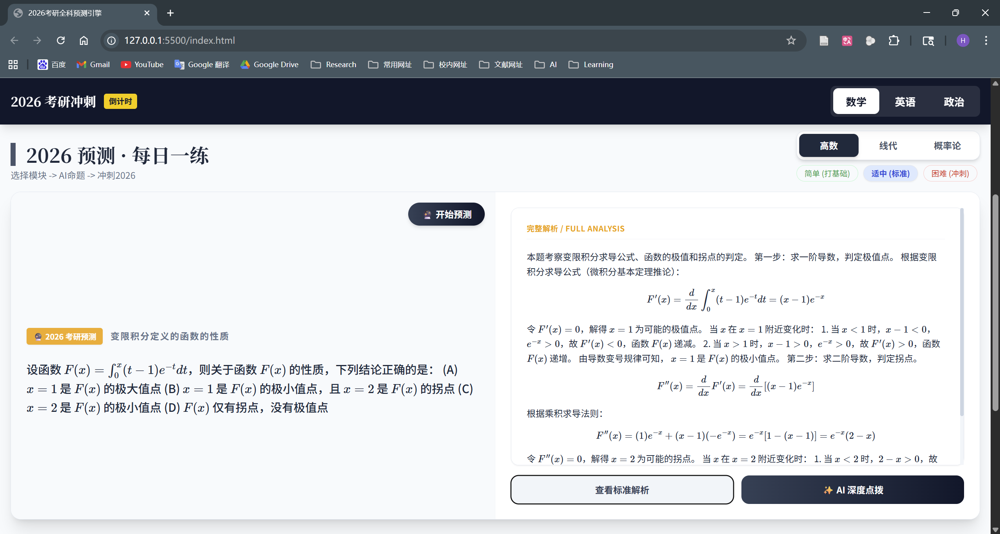

# 🎓 2026 考研全科预测引擎 (NETEM AI Predictor)

> **"不是为了预测未来，而是为了赢在当下。"**  
> *A Next-Gen AI Study Companion powered by Google Gemini.*

  

---

## � 项目简介 (Introduction)

**2026 考研全科预测引擎** 是一款专为考研学子打造的单文件 Web 应用。它利用 **Google Gemini** 强大的大语言模型能力，扮演不同学科的“命题组长”，为你生成高度仿真的考研预测题。

抛弃繁杂的安装配置，只需一个 `index.html` 文件，即可在本地开启沉浸式的模拟备考体验。

## ✨ 核心亮点 (Key Features)

### 1. �‍♂️ 全科 AI 命题组 (AI Role-Playing)
系统根据不同学科自动切换 AI 角色，深度还原命题思维：
- **📐 数学一**：严格遵循考研数一命题习惯，自动渲染 LaTeX 公式。涵盖高数、线代、概率论。
- **🇬🇧 英语一**：精选《经济学人》、《自然》等外刊语料，生成真题级阅读（Part A）及大小作文。
- **🇨🇳 政治**：紧扣 2025-2026 时政热点，精准设置干扰项，考察核心考点。

### 2. 🎚️ 动态难度调控 (Dynamic Difficulty)
不想做无意义的简单题？你可以自由选择难度：
- **🟢 简单 (打基础)**：考察定义与核心公式，直白不绕弯。
- **🔵 适中 (标准)**：完全对标真题难度，检验硬实力。
- **🔴 困难 (冲刺)**：模拟偶数年压轴题，设置陷阱与反直觉考点，挑战极限。

### 3. � 备考急救室 (Emergency Room)
心态崩了？效率低？
内置的“暖心学长”/“学科专家”会根据你当前的科目（数学/英语/政治），提供针对性的知识点拨或心理疏导。支持 **Enter 键** 快速求救。

### 4. ⚡️ 极致轻量与安全 (Web Native)
- **Zero Install**: 只有一个 `.html` 文件，双击即用。
- **Secure**: 您的 API Key 仅存储在本地浏览器 `localStorage` 中，绝不上传至任何第三方服务器。
- **Modern UI**: 基于 Tailwind CSS 设计的玻璃拟态风格 (Glassmorphism)，美观流畅。

---

## 🚀 快速开始 (Getting Started)

### 前置条件
你需要一个 **Google Gemini API Key**。
> [点击这里免费申请 Gemini API Key](https://aistudio.google.com/app/apikey)

### 安装与运行
1.  **下载代码**：克隆本项目或直接下载 `index.html` 文件。
2.  **打开应用**：双击 `index.html`，系统会在默认浏览器中启动。
3.  **激活引擎**：点击页面底部的设置或首次运行时，输入你的 API Key。
4.  **开始预测**：选择学科 -> 选择难度 -> 点击 **"🔮 开始预测"**。

---

## 🛠️ 技术栈 (Tech Stack)

*   **Core**: HTML5, Vanilla JavaScript
*   **Styling**: [Tailwind CSS](https://tailwindcss.com/) (CDN)
*   **AI Model**: [Google Gemini API](https://ai.google.dev/)
*   **Rendering**: 
    *   [MathJax](https://www.mathjax.org/) (LaTeX 公式渲染)
    *   [Marked.js](https://marked.js.org/) (Markdown 解析)

---

## � 界面预览 (Screenshots)

---

## ⚠️ 免责声明 (Disclaimer)

本项目仅供学习交流与辅助备考使用。
AI 生成的题目虽然基于真题逻辑构建，但**不代表**真实的 2026 年考研试题。请结合官方教材与真题进行系统复习。

---

**祝杨宇欣同学，以及所有 2026 考研人：**
### **金榜题名 · 一战成硕！🎉**
